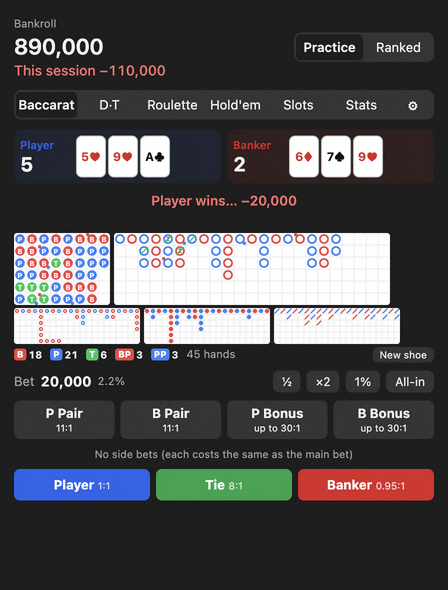
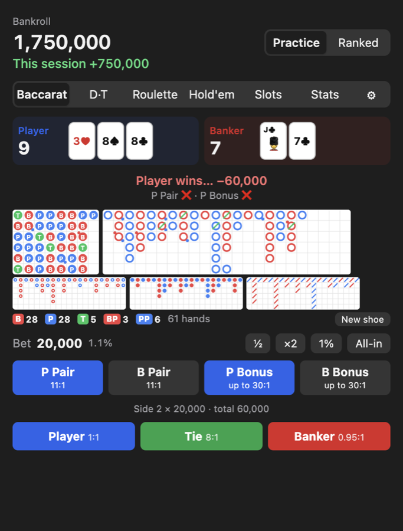
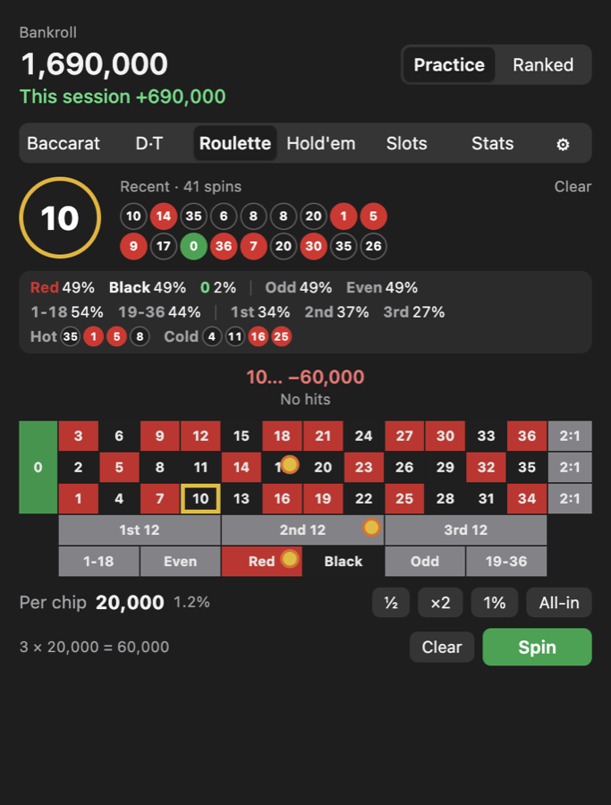
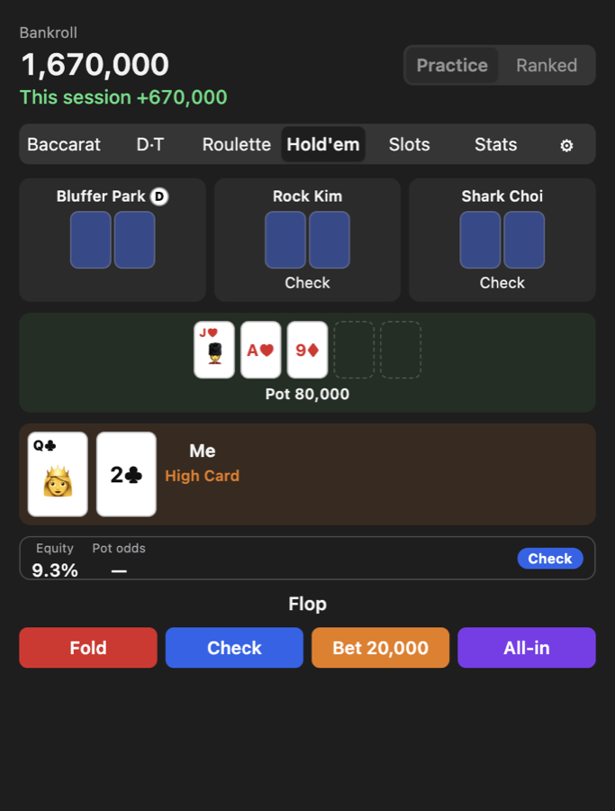
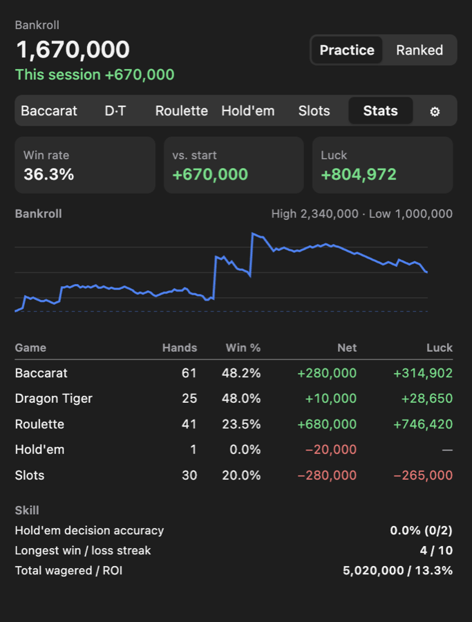

<p align="center"></p>

<h1 align="center">Kasino</h1>

<p align="center">A small casino practice app for the macOS menu bar and the Windows tray.<br>
English · <a href="README.ko.md">한국어</a></p>

Kasino lets you play baccarat, dragon tiger, roulette, hold'em and slots with a practice bankroll, and keeps track of how you're actually doing: win rate, how much of it was luck, and whether your hold'em decisions were sound.

It's for practice only. There's no real money involved, nothing to buy, and nothing to cash out.

<p align="center"></p>

<table>
  <tr>
    <td></td>
    <td></td>
  </tr>
  <tr>
    <td></td>
    <td></td>
  </tr>
</table>

## What's in it

- Baccarat with pair and dragon bonus side bets, plus the full roadmap (bead plate, big road, big eye boy, small road, cockroach pig)
- Dragon tiger with its own roadmap
- European roulette. Click as many numbers or areas as you like, then spin once. It keeps your last 100 spins with red/black, odd/even and dozen percentages, plus hot and cold numbers
- Limit hold'em against three AI players. An optional coach shows your equity and the pot odds on your turn, suggests an action, and tells you afterwards whether your call was a good one
- Ranked mode: sign up with a username and password and you get 1,000 chips. Every game uses them, and everyone is ranked by how many chips they hold. Your practice bankroll stays separate
- Slots
- A stats page with win rate and results per game, a bankroll chart, and a luck index (your actual result minus what the house edge says you should expect)
- Korean, English and Japanese, light and dark mode

## Download

Grab the latest version from [Releases](../../releases/latest).

**Mac** (macOS 13 or later): open `Kasino-x.y.z.dmg` and drag Kasino into Applications. Kasino isn't notarized by Apple, so before opening it the first time, paste this into Terminal once:

```
xattr -dr com.apple.quarantine /Applications/Kasino.app
```

The same instructions are in the DMG. After that, Kasino lives in your menu bar.

**Windows** (10 or 11): run `Kasino-Setup-x.y.z.exe` to install, or `Kasino-x.y.z-portable.exe` to run it without installing. If SmartScreen shows up, click More info > Run anyway. Kasino sits in the system tray next to the clock. Click to open, right-click to quit.

## Building from source

Mac: run `mac/build.sh`. You'll get `Kasino.app` and a DMG in `mac/build`. Needs the Xcode command line tools.

Windows: `cd windows`, `npm install`, then `npm run dist`. The installers end up in `windows/dist`. Use `npm start` if you just want to run it.

Pushing a tag like `v1.0.1` builds both versions on GitHub Actions and attaches them to a new release.

## Privacy

Signing in is optional. Without an account, nothing leaves your computer.

If you create an account, Kasino stores your username, nickname, chip balance and a hashed password (never the password itself) on a Supabase server in Seoul, so the leaderboard can show your rank. No email or other personal information is collected. You can delete your account and its leaderboard entry at any time under Settings > Account.
